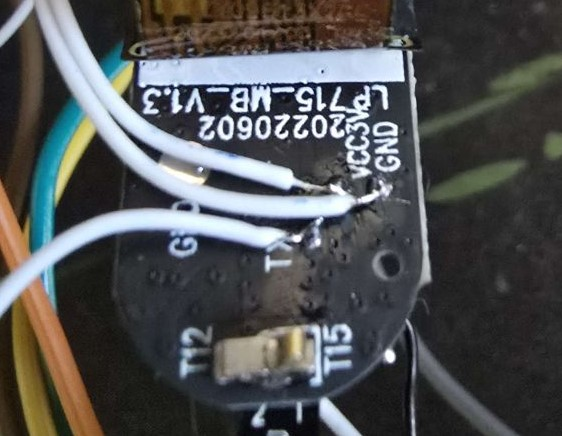
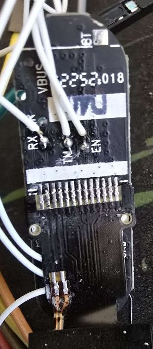
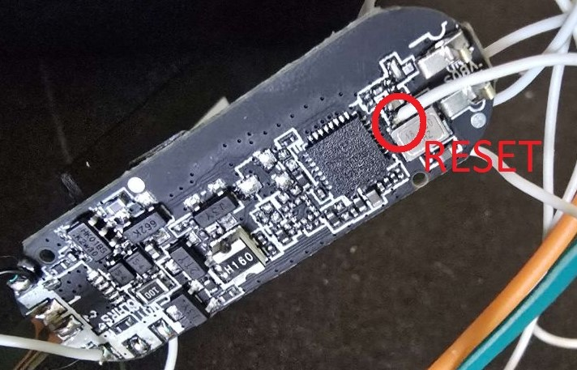

# 🕹️ phy6222_smartwatch  
Reverse engineering and hacking a cheap smartwatch with the PHY6222 MCU.

---

## 🛠️ How to Build

1. Change `COM_PORT` with your own port in Makfile file setting and run `make` in the root directory.  
2. The code will compile, flash the device, and launch a simple log terminal.  
3. Connect the **GND**, **TX**, **RX**, and **RESET** pins to a UART converter.

---

## 🔌 Connection Images

<table>
  <tr>
    <td align="center">
       
      <b>TX & GND PIN</b>
    </td>
    <td align="center">
       
      <b>RX PIN</b>
    </td>
    <td align="center">
       
      <b>RESET PIN</b>
    </td>
  </tr>
</table>